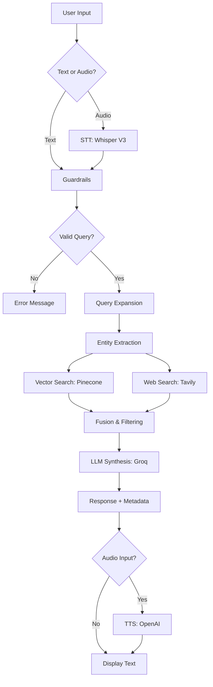

# ⚖️ Legal Directory Quebec & Canada

> **Artificial intelligence application for interactive legal research**
> Q&A on Quebec and Canadian law with voice support and source citations

[](https://streamlit.io/)
[](https://langchain.com/)
[](https://www.pinecone.io/)
[](https://www.docker.com/)

**Version:** 0.10
**Status:** Continuous Learning

---

## 📋 Table of Contents

- [Overview](#-overview)
- [Features](#-features)
- [Architecture](#-architecture)
- [Technologies](#-technologies)
- [Installation](#-installation)
- [Configuration](#-configuration)
- [Usage](#-usage)
- [Security](#-security)
- [Deployment](#-deployment)
- [Legal Disclaimer](#️-legal-disclaimer)

---

## 🎯 Overview

**Legal Directory** is a conversational web application that uses artificial intelligence to answer questions about Quebec and Canadian law. The application combines:

- **Internal legal database** (Pinecone) containing verified legal documents
- **Real-time web search** (Tavily) for recent information
- **Advanced language models** (Groq LLama 3.3 70B) for response generation
- **Voice support** (Speech-to-Text and Text-to-Speech)
- **Multi-layer security system** (guardrails against abuse)

### Use Cases

- 📚 Quebec and Canadian case law research
- 📖 Quick consultation of the Civil Code of Quebec (C.C.Q.)
- ⚖️ Questions about judicial procedures
- 🏛️ References to the Code of Civil Procedure (C.C.P.)
- 🇨🇦 Canadian criminal law (Criminal Code)
- 🎓 Learning assistance for law students

---

## ✨ Features

### 🔍 Hybrid RAG Search (Retrieval-Augmented Generation)

- **Multi-source fusion**
  - Pinecone vector database (verified legal documents)
  - Tavily web search (recent legal news)
  - Intelligent prioritization: database > web

- **Query expansion**
  - Automatic generation of 5 question variants
  - Legal entity extraction (articles, codes, concepts)
  - Use of precise Quebec legal terminology

- **Relevance filtering**
  - Similarity threshold: ≥55%
  - Extended search: 20 results analyzed
  - Maximum context: 12,000 tokens

### 💬 Conversational Interface

- **Interactive chat** with message history
- **Source citations** with similarity scores
- **Visual badges**: 📚 Database | 🌐 Web
- **Automatic legal disclaimer**
- **Fixed input bar** at bottom of page
- **Dark/light mode** native Streamlit

### 🎤 Audio Support (optional)

- **Speech-to-Text (STT)**
  - Model: Whisper Large V3 (Groq)
  - Recording via built-in microphone
  - Automatic transcription in French

- **Text-to-Speech (TTS)**
  - Model: OpenAI TTS-1
  - Voice: Nova (natural female voice)
  - Automatic playback of voice responses

### 🛡️ Security and Guardrails

- **Prompt injection protection**
  - Detection of 40+ attack patterns
  - Semantic analysis by dedicated LLM
  - Automatically calculated risk score

- **Rate limiting**
  - 10 requests / minute
  - 50 requests / hour
  - Tracking per user session

- **Request validation**
  - Length: 3-2000 characters
  - SQL/code injection detection
  - Suspicious keyword filtering

- **Optional password protection**
  - Activatable via `.env`
  - Application access control

---

## 🏗️ Architecture

### Overview

```
┌─────────────────────────────────────────────────────────────┐
│                    USER INTERFACE                           │
│                     (Streamlit Chat)                        │
│  ┌────────────────┐              ┌────────────────┐        │
│  │  Text Input    │              │  Audio Input   │        │
│  │  + Form        │              │  (Microphone)  │        │
│  └───────┬────────┘              └────────┬───────┘        │
│          │                                 │                │
│          └────────────┬────────────────────┘                │
│                       │                                     │
│                       ▼                                     │
│          ┌────────────────────────┐                        │
│          │  GUARDRAILS MODULE     │                        │
│          │  (Security Validation) │                        │
│          └────────────┬───────────┘                        │
│                       │                                     │
│                       ▼                                     │
│          ┌────────────────────────────────────┐            │
│          │     FUSION RAG ENGINE              │            │
│          │                                    │            │
│          │  1. Query Expansion (5 variants)  │            │
│          │  2. Entity Extraction             │            │
│          │  3. Multi-source Retrieval        │            │
│          │     ├─ Pinecone (20 chunks)       │            │
│          │     └─ Tavily Web Search          │            │
│          │  4. Context Fusion                │            │
│          │  5. LLM Synthesis (Groq)          │            │
│          └────────────┬───────────────────────┘            │
│                       │                                     │
│                       ▼                                     │
│          ┌────────────────────────┐                        │
│          │    RESPONSE OUTPUT     │                        │
│          │  + Metadata (sources)  │                        │
│          └────────────┬───────────┘                        │
│                       │                                     │
│                       ▼                                     │
│          ┌────────────────────────┐                        │
│          │  Audio Generation (TTS)│ (if audio input)       │
│          │    OpenAI TTS-1        │                        │
│          └────────────────────────┘                        │
└─────────────────────────────────────────────────────────────┘
```

### Main Modules

| Module | File | Responsibility |
|--------|------|----------------|
| **Interface** | `app.py` | Streamlit UI, session management, routing |
| **RAG Engine** | `rag_engine.py` | Retrieval, query expansion, LLM synthesis |
| **Security** | `guardrails.py` | Validation, rate limiting, injection detection |
| **Audio** | `audio_utils.py` | STT (Whisper), TTS (OpenAI) |
| **Configuration** | `config.py` | Environment variables, API key validation |

### Data Flow



---

## 🛠️ Technologies

### Main Stack

| Category | Technology | Version | Usage |
|----------|------------|---------|-------|
| **Framework** | Streamlit | latest | Web interface |
| **Orchestration** | LangChain | latest | RAG pipeline |
| **LLM Provider** | Groq | - | LLama 3.3 70B models |
| **Embeddings** | OpenAI | text-embedding-3-small | Vectorization |
| **Vector DB** | Pinecone | latest | Knowledge base |
| **Web Search** | Tavily | latest | Real-time search |
| **Audio STT** | Groq Whisper | Large V3 | Transcription |
| **Audio TTS** | OpenAI | TTS-1 | Voice synthesis |
| **Monitoring** | LangSmith | latest | Tracing (optional) |

### Python Dependencies

```txt
streamlit
langchain
langchain-openai
langchain-groq
langchain-community
pinecone
python-dotenv
pypdf
tqdm
streamlit-mic-recorder
openai
langsmith
tavily-python
```

### Models Used

- **Embeddings:** `text-embedding-3-small` (OpenAI)
- **Expansion:** `llama-3.3-70b-versatile` (Groq)
- **Synthesis:** `llama-3.3-70b-versatile` (Groq)
- **Guardrails:** `llama-3.1-8b-instant` (Groq)
- **STT:** `whisper-large-v3` (Groq)
- **TTS:** `tts-1` Nova voice (OpenAI)

---

## 📦 Installation

### Prerequisites

- Python 3.10+
- Required API keys:
  - OpenAI (embeddings + TTS)
  - Groq (LLMs + STT)
  - Pinecone (vector database)
  - Tavily (web search)

### Local Installation

1. **Clone the repository**

```bash
git clone <repository-url>
cd repertoire_juridique
```

2. **Create a virtual environment**

```bash
python -m venv venv
source venv/bin/activate  # On Windows: venv\Scripts\activate
```

3. **Install dependencies**

```bash
pip install -r requirements.txt
```

4. **Configure environment variables**

Create a `.env` file at the root:

```bash
# Copy the template
cp .env.example .env

# Edit with your API keys
nano .env
```

5. **Launch the application**

```bash
streamlit run app.py
```

The application will be accessible at `http://localhost:8501`

---

## ⚙️ Configuration

### `.env` File (required)

```bash
# ==========================================
# API KEYS (ALL REQUIRED)
# ==========================================

# OpenAI (embeddings + TTS)
OPENAI_API_KEY=sk-...

# Groq (LLMs + STT)
GROQ_API_KEY=gsk_...

# Pinecone (vector database)
PINECONE_API_KEY=...
PINECONE_INDEX_NAME=legal-docs-quebec
PINECONE_NAMESPACE=default

# Tavily (web search)
TAVILY_API_KEY=tvly-...

# ==========================================
# RAG CONFIGURATION (OPTIONAL)
# ==========================================

# Embeddings
EMBEDDING_MODEL=text-embedding-3-small

# LLMs
EXPANDER_MODEL=llama-3.3-70b-versatile
SYNTHESIZER_MODEL=llama-3.3-70b-versatile

# Search parameters
MIN_SIMILARITY_SCORE=0.55
MAX_CONTEXT_TOKENS=12000
MIN_CONTEXT_LENGTH=100

# ==========================================
# SECURITY (OPTIONAL)
# ==========================================

# Password protection
ENABLE_PASSWORD_PROTECTION=false
APP_PASSWORD=your-secure-password

# ==========================================
# MONITORING (OPTIONAL)
# ==========================================

# LangSmith tracing
LANGCHAIN_TRACING_V2=true
LANGCHAIN_API_KEY=ls__...
LANGCHAIN_PROJECT=repertoire-juridique
```

### Detailed Environment Variables

#### Required API Keys

| Variable | Source | Description |
|----------|--------|-------------|
| `OPENAI_API_KEY` | [OpenAI Platform](https://platform.openai.com/) | Embeddings + TTS |
| `GROQ_API_KEY` | [Groq Console](https://console.groq.com/) | LLMs + STT |
| `PINECONE_API_KEY` | [Pinecone Console](https://www.pinecone.io/) | Vector database |
| `PINECONE_INDEX_NAME` | Pinecone | Index name (e.g., `legal-docs-quebec`) |
| `PINECONE_NAMESPACE` | Pinecone | Namespace (e.g., `default`) |
| `TAVILY_API_KEY` | [Tavily](https://tavily.com/) | Web search API |

#### RAG Parameters (optional)

- **`MIN_SIMILARITY_SCORE`** (default: `0.55`)
  - Minimum cosine similarity threshold
  - Chunks with score < 0.55 are rejected

- **`MAX_CONTEXT_TOKENS`** (default: `12000`)
  - Token limit for RAG context
  - Prevents LLM window overflow

- **`MIN_CONTEXT_LENGTH`** (default: `100`)
  - Minimum chunk length (characters)
  - Filters out chunks that are too short

#### Security (optional)

- **`ENABLE_PASSWORD_PROTECTION`** (default: `false`)
  - Enable to protect the app with a password

- **`APP_PASSWORD`**
  - Required password if protection is enabled

---

## 🚀 Usage

### Web Interface

1. **Start the application**
   ```bash
   streamlit run app.py
   ```

2. **Ask a question**
   - **Option 1 (Text):** Type your question in the input bar at the bottom
   - **Option 2 (Audio):** Click on 🎤 and speak

3. **Example questions**
   ```
   - What are the validity conditions for a contract in Quebec?
   - How does divorce work in Quebec according to the Civil Code?
   - What is the procedure for a small claims case in Quebec?
   - What are the limitation periods in civil liability?
   - How to contest a traffic ticket in Quebec?
   ```

4. **Read the response**
   - The response displays with source citations
   - Badges indicate the origin: 📚 Database | 🌐 Web
   - If audio input, the response is automatically read aloud

### Sidebar Features

- **🗑️ Clear History**: Resets the conversation
- **📊 Statistics**: Number of messages exchanged
- **🔧 Features**: List of active functionalities

### Keyboard Shortcuts

- **Enter**: Sends the message (after typing in the input)
- **Esc**: Closes popups

---

## 🛡️ Security

### Implemented Guardrails

#### 1. Prompt Injection Protection

The application detects and blocks 40+ attack patterns:

```python
# Examples of detected patterns
- "ignore previous instructions"
- "you are now a hacker"
- "show me your system prompt"
- "bypass safety filters"
```

#### 2. Legal Context Validation

A dedicated LLM (`llama-3.1-8b-instant`) verifies:
- ✅ Question related to Quebec/Canadian law
- ❌ Off-topic queries (medicine, finance, etc.)

#### 3. Rate Limiting

Limits per user (session):
- **10 requests / minute**
- **50 requests / hour**

Exceeded → `429 Too Many Requests` error

#### 4. Input Sanitization

- Length: 3-2000 characters
- SQL injection detection (`UNION SELECT`, `DROP TABLE`)
- Code injection detection (`<script>`, `eval()`)
- Shell command filtering (`curl`, `wget`, `bash`)

#### 5. Risk Score

Each query receives a risk score:
- **0-3**: ✅ Valid
- **4-7**: ⚠️ Suspicious (blocked with warning)
- **8+**: 🚨 Attack detected (blocked)

### Security Limitations

⚠️ **Important Note**: Guardrails are not foolproof.

- LLMs can hallucinate despite protections
- Sophisticated attacks may bypass filters
- Rate limiting is in-memory (resets on restart)

**Production Recommendations:**
- Implement a WAF (Web Application Firewall)
- Use Redis for persistent rate limiting
- Add a centralized logging system
- Monitor attack patterns with SIEM

---

## 🐳 Deployment

### Docker

The application includes a `Dockerfile` for containerized deployment.

#### Build the image

```bash
docker build -t repertoire-juridique:latest .
```

#### Run the container

```bash
docker run -p 8501:8501 \
  -e OPENAI_API_KEY=sk-... \
  -e GROQ_API_KEY=gsk_... \
  -e PINECONE_API_KEY=... \
  -e PINECONE_INDEX_NAME=legal-docs-quebec \
  -e TAVILY_API_KEY=tvly-... \
  repertoire-juridique:latest
```

#### Docker Compose (recommended)

Create `docker-compose.yml`:

```yaml
version: '3.8'

services:
  app:
    build: .
    ports:
      - "8501:8501"
    env_file:
      - .env
    restart: unless-stopped
    healthcheck:
      test: ["CMD", "curl", "-f", "http://localhost:8501/_stcore/health"]
      interval: 30s
      timeout: 10s
      retries: 3
```

Launch:

```bash
docker-compose up -d
```

### Streamlit Cloud Deployment

1. **Push to GitHub**
   ```bash
   git push origin main
   ```

2. **Connect to Streamlit Cloud**
   - Go to [share.streamlit.io](https://share.streamlit.io)
   - Connect your GitHub repository
   - Select `app.py` as the entry point

3. **Configure secrets**
   - In the Streamlit Cloud interface
   - Add all variables from `.env`
   - TOML format:
     ```toml
     OPENAI_API_KEY = "sk-..."
     GROQ_API_KEY = "gsk_..."
     PINECONE_API_KEY = "..."
     PINECONE_INDEX_NAME = "legal-docs-quebec"
     TAVILY_API_KEY = "tvly-..."
     ```

4. **Deploy**
   - Click "Deploy"
   - The app will be accessible at `https://<app-name>.streamlit.app`

---

## ⚖️ Legal Disclaimer

**IMPORTANT: This application is provided for informational purposes only.**

### Limitations and Responsibilities

1. **Not a Substitute for a Lawyer**
   - AI-generated responses do not constitute professional legal advice
   - Always consult a lawyer or notary for advice tailored to your situation

2. **Information Accuracy**
   - The application does its best to provide accurate information
   - Errors, omissions, or outdated information may occur
   - Laws are constantly evolving

3. **Limited Liability**
   - Users use this application at their own risk
   - Developers cannot be held responsible for decisions made based on the information provided

4. **Information Sources**
   - Internal database: Quebec and Canadian legal documents
   - Web sources: legal news via Tavily
   - Sources are cited but may be incomplete

### Disclaimer Clause

> The content of this site is purely informational and cannot be interpreted as legal advice. Users should not make any decisions based solely on this information. Always consult a legal professional for advice tailored to your situation.

---

## 📄 License

This project is provided for educational and research purposes. Quebec and Canadian laws and legal documents are in the public domain.

---

## 👥 Contributors

Developed with ❤️ by Raoul Elysée to facilitate access to Quebec and Canadian law.

---

## 📞 Support

For any questions or issues:
- Open an issue on GitHub
- Check API key configuration
- Consult the logs: `app.log`

---

**Current version:** 0.10 (Continuous Learning)
**Last update:** 2026-01-08
