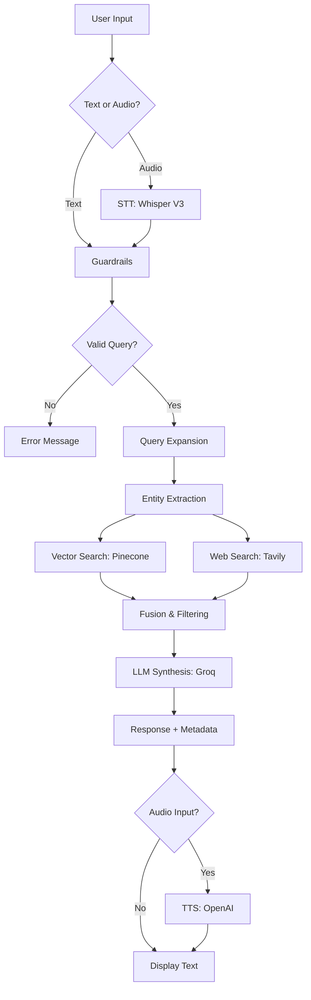

# ⚖️ Répertoire Juridique Québec & Canada

> **Application d'intelligence artificielle pour la recherche juridique interactive**
> Questions-réponses sur le droit québécois et canadien avec support vocal et citations des sources

[](https://streamlit.io/)
[](https://langchain.com/)
[](https://www.pinecone.io/)
[](https://www.docker.com/)

**Version:** 0.10
**Statut:** En apprentissage continu

---

## 📋 Table des matières

- [Aperçu](#-aperçu)
- [Fonctionnalités](#-fonctionnalités)
- [Architecture](#-architecture)
- [Technologies](#-technologies)
- [Installation](#-installation)
- [Configuration](#-configuration)
- [Utilisation](#-utilisation)
- [Sécurité](#-sécurité)
- [Déploiement](#-déploiement)
- [Avertissement légal](#️-avertissement-légal)

---

## 🎯 Aperçu

**Répertoire Juridique** est une application web conversationnelle qui utilise l'intelligence artificielle pour répondre aux questions sur le droit québécois et canadien. L'application combine :

- **Base de données juridique interne** (Pinecone) contenant des documents juridiques vérifiés
- **Recherche web en temps réel** (Tavily) pour les informations récentes
- **Modèles de langage avancés** (Groq LLama 3.3 70B) pour la génération de réponses
- **Support vocal** (Speech-to-Text et Text-to-Speech)
- **Système de sécurité multi-couches** (guardrails contre les abus)

### Cas d'usage

- 📚 Recherche de jurisprudence québécoise et canadienne
- 📖 Consultation rapide du Code civil du Québec (C.c.Q.)
- ⚖️ Questions sur les procédures judiciaires
- 🏛️ Références au Code de procédure civile (C.p.c.)
- 🇨🇦 Droit pénal canadien (Code criminel)
- 🎓 Aide à l'apprentissage pour étudiants en droit

---

## ✨ Fonctionnalités

### 🔍 Recherche hybride RAG (Retrieval-Augmented Generation)

- **Fusion de sources multiples**
  - Base de données vectorielle Pinecone (documents juridiques vérifiés)
  - Recherche web Tavily (actualités juridiques récentes)
  - Priorisation intelligente : base de données > web

- **Expansion de requêtes**
  - Génération automatique de 5 variantes de la question
  - Extraction d'entités juridiques (articles, codes, concepts)
  - Utilisation de termes juridiques précis du Québec

- **Filtrage par pertinence**
  - Seuil de similarité : ≥55%
  - Recherche élargie : 20 résultats analysés
  - Contexte maximal : 12 000 tokens

### 💬 Interface conversationnelle

- **Chat interactif** avec historique des messages
- **Citations des sources** avec scores de similarité
- **Badges visuels** : 📚 Base de données | 🌐 Web
- **Disclaimer légal** automatique
- **Barre d'input fixe** en bas de page
- **Mode sombre/clair** natif Streamlit

### 🎤 Support audio (optionnel)

- **Speech-to-Text (STT)**
  - Modèle : Whisper Large V3 (Groq)
  - Enregistrement via microphone intégré
  - Transcription automatique en français

- **Text-to-Speech (TTS)**
  - Modèle : OpenAI TTS-1
  - Voix : Nova (voix féminine naturelle)
  - Lecture automatique des réponses vocales

### 🛡️ Sécurité et guardrails

- **Protection contre prompt injection**
  - Détection de 40+ patterns d'attaque
  - Analyse sémantique par LLM dédié
  - Score de risque calculé automatiquement

- **Rate limiting**
  - 10 requêtes / minute
  - 50 requêtes / heure
  - Tracking par session utilisateur

- **Validation des requêtes**
  - Longueur : 3-2000 caractères
  - Détection SQL/code injection
  - Filtrage de mots-clés suspects

- **Protection optionnelle par mot de passe**
  - Activable via `.env`
  - Contrôle d'accès à l'application

---

## 🏗️ Architecture

### Vue d'ensemble

```
┌─────────────────────────────────────────────────────────────┐
│                   INTERFACE UTILISATEUR                     │
│                     (Streamlit Chat)                        │
│  ┌────────────────┐              ┌────────────────┐        │
│  │  Input Texte   │              │  Input Audio   │        │
│  │  + Formulaire  │              │  (Microphone)  │        │
│  └───────┬────────┘              └────────┬───────┘        │
│          │                                 │                │
│          └────────────┬────────────────────┘                │
│                       │                                     │
│                       ▼                                     │
│          ┌────────────────────────┐                        │
│          │  GUARDRAILS MODULE     │                        │
│          │  (Security Validation) │                        │
│          └────────────┬───────────┘                        │
│                       │                                     │
│                       ▼                                     │
│          ┌────────────────────────────────────┐            │
│          │     FUSION RAG ENGINE              │            │
│          │                                    │            │
│          │  1. Query Expansion (5 variants)  │            │
│          │  2. Entity Extraction             │            │
│          │  3. Multi-source Retrieval        │            │
│          │     ├─ Pinecone (20 chunks)       │            │
│          │     └─ Tavily Web Search          │            │
│          │  4. Context Fusion                │            │
│          │  5. LLM Synthesis (Groq)          │            │
│          └────────────┬───────────────────────┘            │
│                       │                                     │
│                       ▼                                     │
│          ┌────────────────────────┐                        │
│          │    RESPONSE OUTPUT     │                        │
│          │  + Metadata (sources)  │                        │
│          └────────────┬───────────┘                        │
│                       │                                     │
│                       ▼                                     │
│          ┌────────────────────────┐                        │
│          │  Audio Generation (TTS)│ (if audio input)       │
│          │    OpenAI TTS-1        │                        │
│          └────────────────────────┘                        │
└─────────────────────────────────────────────────────────────┘
```

### Modules principaux

| Module | Fichier | Responsabilité |
|--------|---------|----------------|
| **Interface** | `app.py` | UI Streamlit, gestion session, routing |
| **Moteur RAG** | `rag_engine.py` | Retrieval, expansion requêtes, synthèse LLM |
| **Sécurité** | `guardrails.py` | Validation, rate limiting, injection detection |
| **Audio** | `audio_utils.py` | STT (Whisper), TTS (OpenAI) |
| **Configuration** | `config.py` | Variables d'environnement, validation API keys |

### Flux de données



---

## 🛠️ Technologies

### Stack principal

| Catégorie | Technologie | Version | Usage |
|-----------|-------------|---------|-------|
| **Framework** | Streamlit | latest | Interface web |
| **Orchestration** | LangChain | latest | Pipeline RAG |
| **LLM Provider** | Groq | - | Modèles LLama 3.3 70B |
| **Embeddings** | OpenAI | text-embedding-3-small | Vectorisation |
| **Vector DB** | Pinecone | latest | Base de connaissances |
| **Web Search** | Tavily | latest | Recherche temps réel |
| **Audio STT** | Groq Whisper | Large V3 | Transcription |
| **Audio TTS** | OpenAI | TTS-1 | Synthèse vocale |
| **Monitoring** | LangSmith | latest | Traçage (optionnel) |

### Dépendances Python

```txt
streamlit
langchain
langchain-openai
langchain-groq
langchain-community
pinecone
python-dotenv
pypdf
tqdm
streamlit-mic-recorder
openai
langsmith
tavily-python
```

### Modèles utilisés

- **Embeddings:** `text-embedding-3-small` (OpenAI)
- **Expansion:** `llama-3.3-70b-versatile` (Groq)
- **Synthèse:** `llama-3.3-70b-versatile` (Groq)
- **Guardrails:** `llama-3.1-8b-instant` (Groq)
- **STT:** `whisper-large-v3` (Groq)
- **TTS:** `tts-1` voix Nova (OpenAI)

---

## 📦 Installation

### Prérequis

- Python 3.10+
- Clés API requises :
  - OpenAI (embeddings + TTS)
  - Groq (LLMs + STT)
  - Pinecone (vector database)
  - Tavily (web search)

### Installation locale

1. **Cloner le dépôt**

```bash
git clone <repository-url>
cd repertoire_juridique
```

2. **Créer un environnement virtuel**

```bash
python -m venv venv
source venv/bin/activate  # Sur Windows: venv\Scripts\activate
```

3. **Installer les dépendances**

```bash
pip install -r requirements.txt
```

4. **Configurer les variables d'environnement**

Créer un fichier `.env` à la racine :

```bash
# Copier le template
cp .env.example .env

# Éditer avec vos clés API
nano .env
```

5. **Lancer l'application**

```bash
streamlit run app.py
```

L'application sera accessible à `http://localhost:8501`

---

## ⚙️ Configuration

### Fichier `.env` (requis)

```bash
# ==========================================
# API KEYS (TOUTES OBLIGATOIRES)
# ==========================================

# OpenAI (embeddings + TTS)
OPENAI_API_KEY=sk-...

# Groq (LLMs + STT)
GROQ_API_KEY=gsk_...

# Pinecone (vector database)
PINECONE_API_KEY=...
PINECONE_INDEX_NAME=legal-docs-quebec
PINECONE_NAMESPACE=default

# Tavily (web search)
TAVILY_API_KEY=tvly-...

# ==========================================
# CONFIGURATION RAG (OPTIONNEL)
# ==========================================

# Embeddings
EMBEDDING_MODEL=text-embedding-3-small

# LLMs
EXPANDER_MODEL=llama-3.3-70b-versatile
SYNTHESIZER_MODEL=llama-3.3-70b-versatile

# Paramètres de recherche
MIN_SIMILARITY_SCORE=0.55
MAX_CONTEXT_TOKENS=12000
MIN_CONTEXT_LENGTH=100

# ==========================================
# SÉCURITÉ (OPTIONNEL)
# ==========================================

# Protection par mot de passe
ENABLE_PASSWORD_PROTECTION=false
APP_PASSWORD=your-secure-password

# ==========================================
# MONITORING (OPTIONNEL)
# ==========================================

# LangSmith tracing
LANGCHAIN_TRACING_V2=true
LANGCHAIN_API_KEY=ls__...
LANGCHAIN_PROJECT=repertoire-juridique
```

### Variables d'environnement détaillées

#### API Keys obligatoires

| Variable | Source | Description |
|----------|--------|-------------|
| `OPENAI_API_KEY` | [OpenAI Platform](https://platform.openai.com/) | Embeddings + TTS |
| `GROQ_API_KEY` | [Groq Console](https://console.groq.com/) | LLMs + STT |
| `PINECONE_API_KEY` | [Pinecone Console](https://www.pinecone.io/) | Vector database |
| `PINECONE_INDEX_NAME` | Pinecone | Nom de l'index (ex: `legal-docs-quebec`) |
| `PINECONE_NAMESPACE` | Pinecone | Namespace (ex: `default`) |
| `TAVILY_API_KEY` | [Tavily](https://tavily.com/) | Web search API |

#### Paramètres RAG (optionnels)

- **`MIN_SIMILARITY_SCORE`** (défaut: `0.55`)
  - Seuil de similarité cosinus minimum
  - Chunks avec score < 0.55 sont rejetés

- **`MAX_CONTEXT_TOKENS`** (défaut: `12000`)
  - Limite de tokens pour le contexte RAG
  - Évite les dépassements de fenêtre LLM

- **`MIN_CONTEXT_LENGTH`** (défaut: `100`)
  - Longueur minimale d'un chunk (caractères)
  - Filtre les extraits trop courts

#### Sécurité (optionnelle)

- **`ENABLE_PASSWORD_PROTECTION`** (défaut: `false`)
  - Activez pour protéger l'app par mot de passe

- **`APP_PASSWORD`**
  - Mot de passe requis si protection activée

---

## 🚀 Utilisation

### Interface web

1. **Démarrer l'application**
   ```bash
   streamlit run app.py
   ```

2. **Poser une question**
   - **Option 1 (Texte):** Tapez votre question dans la barre d'input en bas
   - **Option 2 (Audio):** Cliquez sur 🎤 et parlez

3. **Exemples de questions**
   ```
   - Quelles sont les conditions de validité d'un contrat au Québec?
   - Comment fonctionne le divorce au Québec selon le Code civil?
   - Quelle est la procédure pour une petite créance au Québec?
   - Quels sont les délais de prescription en responsabilité civile?
   - Comment contester une contravention au Québec?
   ```

4. **Lire la réponse**
   - La réponse s'affiche avec des citations des sources
   - Les badges indiquent l'origine : 📚 Base de données | 🌐 Web
   - Si entrée audio, la réponse est lue automatiquement

### Fonctionnalités de la sidebar

- **🗑️ Effacer l'historique** : Réinitialise la conversation
- **📊 Statistiques** : Nombre de messages échangés
- **🔧 Caractéristiques** : Liste des fonctionnalités actives

### Raccourcis clavier

- **Entrée** : Envoie le message (après avoir tapé dans l'input)
- **Échap** : Ferme les popups

---

## 🛡️ Sécurité

### Guardrails implémentés

#### 1. Protection contre prompt injection

L'application détecte et bloque 40+ patterns d'attaque :

```python
# Exemples de patterns détectés
- "ignore previous instructions"
- "you are now a hacker"
- "show me your system prompt"
- "bypass safety filters"
```

#### 2. Validation de contexte juridique

Un LLM dédié (`llama-3.1-8b-instant`) vérifie :
- ✅ Question liée au droit québécois/canadien
- ❌ Requêtes hors sujet (médecine, finance, etc.)

#### 3. Rate limiting

Limites par utilisateur (session) :
- **10 requêtes / minute**
- **50 requêtes / heure**

Dépassement → erreur `429 Too Many Requests`

#### 4. Sanitisation des inputs

- Longueur : 3-2000 caractères
- Détection SQL injection (`UNION SELECT`, `DROP TABLE`)
- Détection code injection (`<script>`, `eval()`)
- Filtrage shell commands (`curl`, `wget`, `bash`)

#### 5. Score de risque

Chaque requête reçoit un score de risque :
- **0-3** : ✅ Valide
- **4-7** : ⚠️ Suspect (bloqué avec avertissement)
- **8+** : 🚨 Attaque détectée (bloqué)

### Limitations de sécurité

⚠️ **Note importante** : Les guardrails ne sont pas infaillibles.

- Les LLMs peuvent halluciner malgré les protections
- Des attaques sophistiquées peuvent contourner les filtres
- Le rate limiting est en mémoire (réinitialise au redémarrage)

**Recommandations pour production :**
- Implémenter un WAF (Web Application Firewall)
- Utiliser Redis pour le rate limiting persistant
- Ajouter un système de logs centralisé
- Monitorer les patterns d'attaque avec SIEM

---

## 🐳 Déploiement

### Docker

L'application inclut un `Dockerfile` pour le déploiement containerisé.

#### Build de l'image

```bash
docker build -t repertoire-juridique:latest .
```

#### Run du conteneur

```bash
docker run -p 8501:8501 \
  -e OPENAI_API_KEY=sk-... \
  -e GROQ_API_KEY=gsk_... \
  -e PINECONE_API_KEY=... \
  -e PINECONE_INDEX_NAME=legal-docs-quebec \
  -e TAVILY_API_KEY=tvly-... \
  repertoire-juridique:latest
```

#### Docker Compose (recommandé)

Créer `docker-compose.yml` :

```yaml
version: '3.8'

services:
  app:
    build: .
    ports:
      - "8501:8501"
    env_file:
      - .env
    restart: unless-stopped
    healthcheck:
      test: ["CMD", "curl", "-f", "http://localhost:8501/_stcore/health"]
      interval: 30s
      timeout: 10s
      retries: 3
```

Lancer :

```bash
docker-compose up -d
```

### Déploiement Streamlit Cloud

1. **Pusher sur GitHub**
   ```bash
   git push origin main
   ```

2. **Connecter à Streamlit Cloud**
   - Aller sur [share.streamlit.io](https://share.streamlit.io)
   - Connecter votre dépôt GitHub
   - Sélectionner `app.py` comme point d'entrée

3. **Configurer les secrets**
   - Dans l'interface Streamlit Cloud
   - Ajouter toutes les variables du `.env`
   - Format TOML :
     ```toml
     OPENAI_API_KEY = "sk-..."
     GROQ_API_KEY = "gsk_..."
     PINECONE_API_KEY = "..."
     PINECONE_INDEX_NAME = "legal-docs-quebec"
     TAVILY_API_KEY = "tvly-..."
     ```

4. **Déployer**
   - Cliquer sur "Deploy"
   - L'app sera accessible à `https://<app-name>.streamlit.app`

---

## ⚖️ Avertissement légal

**IMPORTANT : Cette application est fournie à titre informatif uniquement.**

### Limitations et responsabilités

1. **Non-substitution à un avocat**
   - Les réponses générées par l'IA ne constituent pas des conseils juridiques professionnels
   - Consultez toujours un avocat ou un notaire pour des conseils adaptés à votre situation

2. **Exactitude des informations**
   - L'application fait de son mieux pour fournir des informations précises
   - Des erreurs, omissions ou informations obsolètes peuvent survenir
   - Les lois évoluent constamment

3. **Responsabilité limitée**
   - L'utilisateur utilise cette application à ses propres risques
   - Les développeurs ne peuvent être tenus responsables des décisions prises sur la base des informations fournies

4. **Sources d'information**
   - Base de données interne : documents juridiques québécois et canadiens
   - Sources web : actualités juridiques via Tavily
   - Les sources sont citées mais peuvent être incomplètes

### Clause de non-responsabilité

> Le contenu de ce site est purement informatif et ne peut être interprété comme un avis juridique. L'utilisateur ne devrait prendre aucune décision en se basant uniquement sur ces renseignements. Consultez toujours un professionnel du droit pour des conseils adaptés à votre situation.

---

## 📄 Licence

Ce projet est fourni à des fins éducatives et de recherche. Les lois et documents juridiques du Québec et du Canada sont du domaine public.

---

## 👥 Contributeurs

Développé avec ❤️ pour faciliter l'accès au droit québécois et canadien.

---

## 📞 Support

Pour toute question ou problème :
- Ouvrir une issue sur GitHub
- Vérifier la configuration des API keys
- Consulter les logs : `app.log`

---

**Version actuelle :** 0.10 (En apprentissage continu)
**Dernière mise à jour :** 2026-01-08
